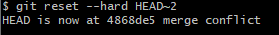

# LR6
Лабораторная работа №6

## Progress of work

### 1. Настройка клиента

### 2. Клонирование удаленного репозитория

### 3. Добавление файла через интерфейс гита

### 4. История операция для каждой ветки

### 5. Последние изменения
    git diff
### 6. Слияние в ветку master, решение конфликтов

### 7. Сделать несколько комитов с изменениями

### 8. Хард откат комита

### 9. Создать ветку для отчета

## Command logs

- git config -l
- git clone git@github.com:reven-n1/LR6.git
- cd LR6/
- git pull

**/добавление файла через интерфейс гита/**

- git log
- git diff(git show commit~ commit)
- git checkout master
- git merge origin/branch1

**

/решение конфликта/
**

before

after

- git add mergefile.txt 
- git commit -am "soleved merge conflict"

- git branch -d branch1

**/изменения в wtf.py - 1/**
- git add .
- git commit -am "1st change"

**/изменения в wtf.py - 2/**
- git add .
- git commit -am "2nd change"
- git reset --hard HEAD~2
- git checkout -b "report"

- mkdir img

## Форматированная история комитов

git log --pretty=format:"%h - %an, %ar : %s"

